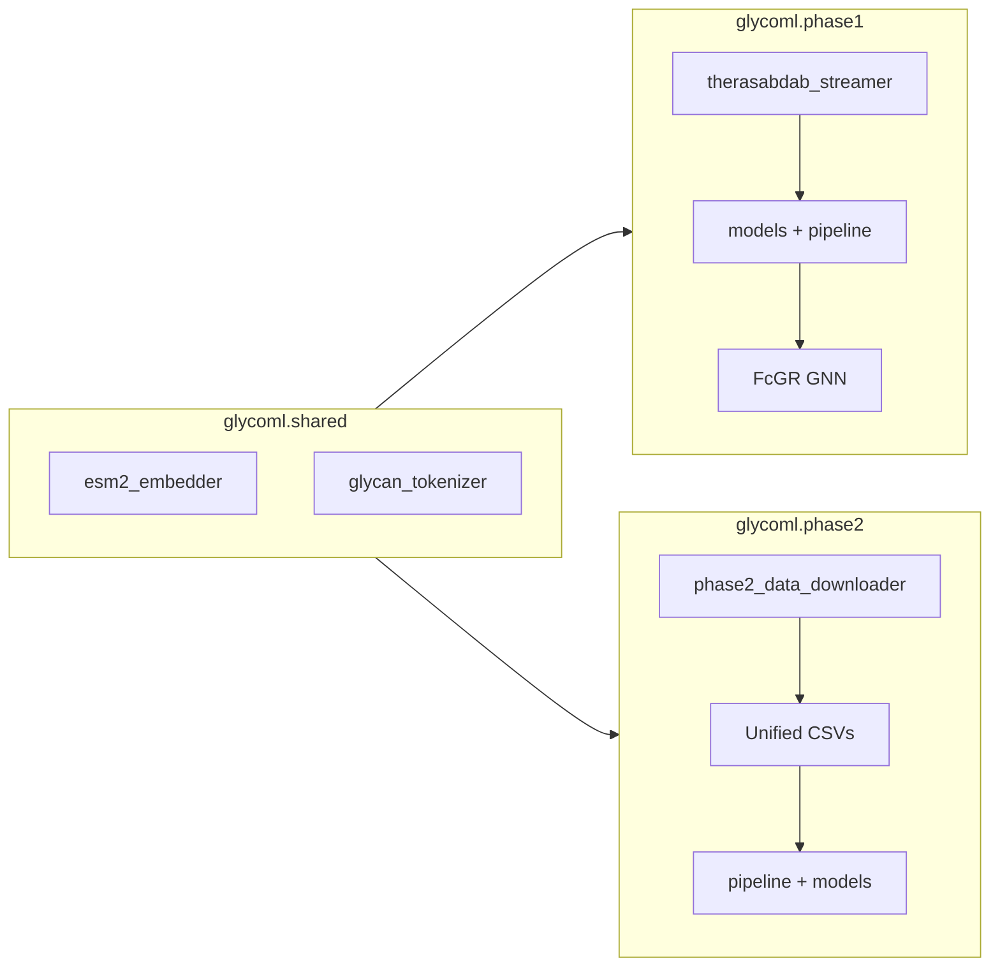

# Architecture Overview

```mermaid
flowchart LR
  subgraph Shared[glycoml.shared]
    ESM[esm2_embedder]
    TOK[glycan_tokenizer]
  end

  subgraph Phase1[glycoml.phase1]
    A1[therasabdab_streamer] --> A2[models + pipeline]
    A2 --> A3[FcGR GNN]
  end

  subgraph Phase2[glycoml.phase2]
    B1[phase2_data_downloader] --> B2[Unified CSVs]
    B2 --> B3[pipeline + models]
  end

  Shared --> Phase1
  Shared --> Phase2
```
